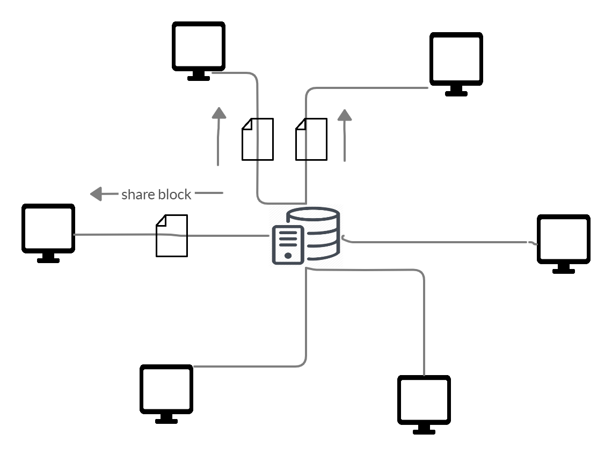

<p align=center>
</p>

# Centralized Peer-to-Peer File Sharing Architecture

## Contents
* [Working](#working)
* [Requirements](#requirements)
* [Installation Process](#installation-process)
* [Compilation](#compilation)
* [Execution](#execution)
* [Bugs](#bugs)
* [Finalization](#finalization)

The aim of this project is to provide a file sharing system, among the peers connected to the network, administered by a centralized server.

## Working

### Commands supported:
| Command syntax | Function | Example | Parameters |
| -------------- | -------- | ------- | ---------- |
| -sys `COMMAND` | Executes the `COMMAND` as a CLI | -sys ls | None |
| -s `OPTION` | Message intended for server | -s exit | <ul><li>`exit` -> closes the connection with server.<li> `upload` -> Uploads a file to the server.<li> `ls` -> Requests the files list from the server.<li>`download` -> Requests to download a file from the server. | 
* A client first joins the network by registering a username and password with the server, or by loging in if it's already registered.
<p align=center>
</p>

* The client can upload a file to the server, using the command `-s upload`, and then specifying the local path of the file.
 <p align=center>
</p>

* The server then splits the file based on a fixed block size, and uploads these blocks to clients connected to the network. The location of each block is recorded.
 <p align=center>
</p>

* The client can request for a file from the server using the command `-s download`, specifying the name of the file. The server then sends the block locations of the file to the requesting client.
 <p align=center>
</p>

* The client then downloads all the blocks from it's respective locations. It then merges these blocks, to retrieve the file.
 <p align=center>
</p>

## Requirements
* Linux based Operating System.
* Internet Connection

## Installation Process

* Download the server.c and client.c files.

### Server side
* Installing MySQL
    * Execute the following commands on Ubuntu: <br />
        `sudo apt-get update` <br />
        `sudo apt-get install mysql-server`

* Create a new database 'p2p' and add thefour tables to it, namely:
    * login_details
    ```
    CREATE TABLE login_details(log_id INT PRIMARY KEY, user_name TEXT, password TEXT, isOnline TINYINT(1));
    ```

    | Field     | Type       | Null | Key | Default | Extra |
    |-----------|------------|------|-----|---------|-------|
    | log_id    | int        | NO   | PRI | NULL    |       |
    | user_name | text       | YES  |     | NULL    |       |
    | password  | text       | YES  |     | NULL    |       |
    | isOnline  | tinyint(1) | YES  |     | NULL    |       |

    * online_clients
    ```
    CREATE TABLE online_clients(p_id INT PRIMARY KEY, IP TEXT NOT NULL, port INT NOT NULL,
    log_id TEXT NOT NULL, FOREIGN KEY (log_id) REFERENCES login_details(log_id));
   ```

    | Field  | Type | Null | Key | Default | Extra |
    |--------|------|------|-----|---------|-------|
    | p_id   | int  | NO   | PRI | NULL    |       |
    | IP     | text | NO   |     | NULL    |       |
    | port   | int  | NO   |     | NULL    |       |
    | log_id | int  | NO   | MUL | NULL    |       |

    * files
    ```
    CREATE TABLE files(f_id INT PRIMARY KEY, filename TEXT NOT NULL, p_id INT);
    ```

    | Field    | Type | Null | Key | Default | Extra |
    |----------|------|------|-----|---------|-------|
    | f_id     | int  | NO   | PRI | NULL    |       |
    | filename | text | NO   |     | NULL    |       |
    | p_id     | int  | NO   |     | NULL    |       |

    * blocks
    ```
    CREATE TABLE blocks(blockname TEXT NOT NULL, dst_IP TEXT NOT NULL, dst_port INT NOT NULL,
    f_id INT NOT NULL, FOREIGN KEY (f_id) REFERENCES files(f_id));
    ```

    | Field     | Type | Null | Key | Default | Extra |
    |-----------|------|------|-----|---------|-------|
    | blockname | text | NO   |     | NULL    |       |
    | dst_IP    | text | NO   |     | NULL    |       |
    | dst_port  | int  | NO   |     | NULL    |       |
    | f_id      | int  | NO   | MUL | NULL    |       |

* Create a new user and grant all privileges to it.

## Compilation
* Compile the server side code using the following command : <br />
>        gcc server.c -o server.out `mysql_config --cflags --libs`
* Compile the client side code using the following command : <br />
>        gcc client.c -o client.out 

## Execution
* First start the server side program using `./server.out` and provide the following details: <br />
    * Server Port Number
    * User id and password of the MySQL client

* Start the client side program using `./client.out` and provide the following details: <br />
    * Server IP address and port number
    * UDP socket port number

* Once connection with server is established, choose whether the client is a new user or not.
* The client enters it's user name and password, which is registered/auhtenticated by the server.

## BUGS
- **The number of blocks created should depend on a fixed block size, and not on the number of users online (as is the case now.)**
- The occasional file transfer errors that occur needs to be fixed.
- Maybe using file descriptors was not the right choice after all. Maybe threading is better?

## Finalization
- Remove the clear table commands that is executed, everytime the server starts.
- Adding the GUI looks close to impossible. Quite the unexpected. It wants me to conver this while thing to a library!
- Add compression: Looking into arithmetic encoding.
- Add encryption.
